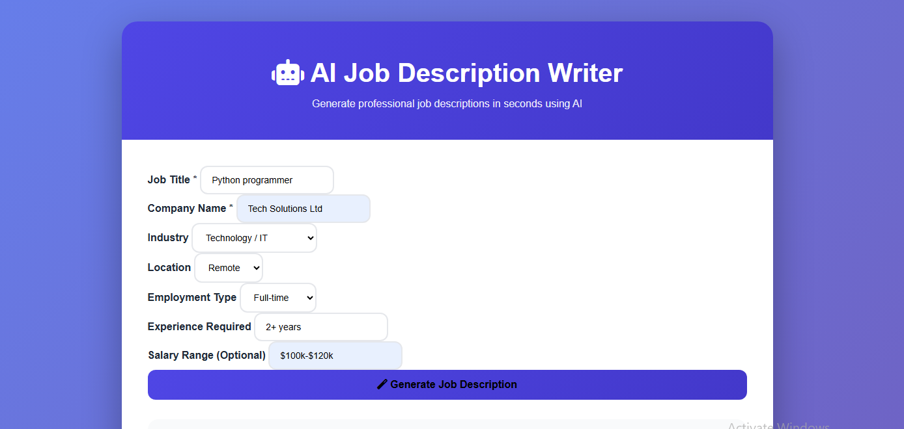
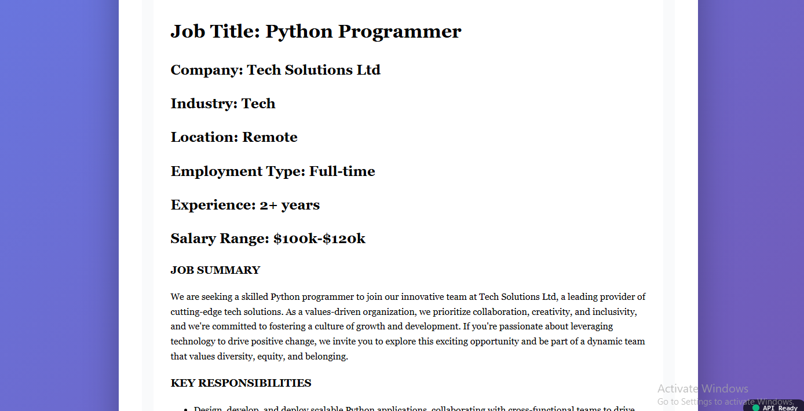
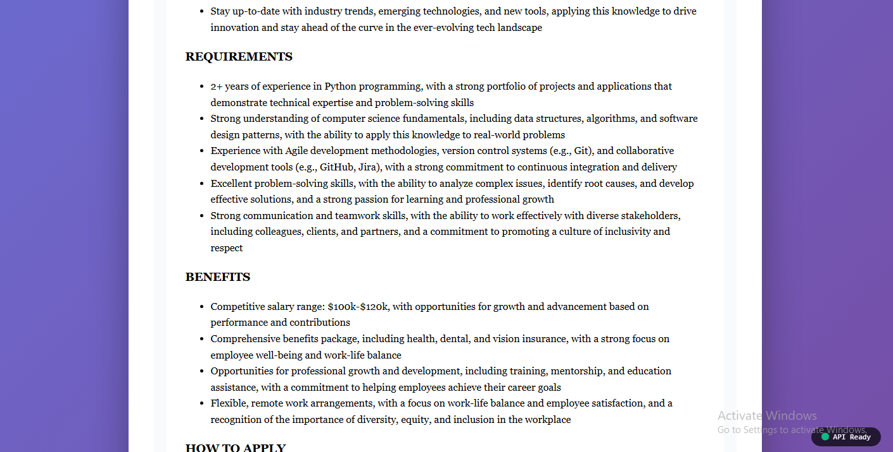
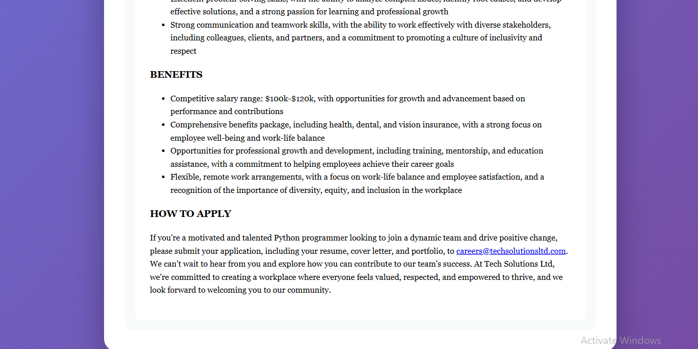

# 🤖 AI Job Description Writer

## 🚀 AI-powered professional job description generator

Generate professional job descriptions in **30 seconds** using Groq API (Llama 3.3 70B model).

---

## ✨ Features

- ⚡ **Fast** - Generate job descriptions in 30 seconds
- 🎨 **Customizable** - Adjust responsibilities, requirements, benefits
- 📱 **Responsive** - Works on desktop, tablet, mobile
- 💼 **Professional** - HR-approved format
- 🔓 **Lifetime** - One-time payment, no monthly fee

---

## 🛠️ Tech Stack

| Technology | Purpose |
|------------|---------|
| Python Flask | Backend API |
| Groq API | AI (Llama 3.3 70B) |
| HTML/CSS | Frontend UI |
| Bootstrap | Responsive design |
| Render | Hosting (Free tier) |

---

## 📸 Screenshots

| Home Page | Generated Output |
|-----------|------------------|
|  |  |

| Form Input | Result |
|------------|--------|
|  |  |

---

## 💰 Pricing

| Package | Price | Features |
|---------|-------|----------|
| Basic | $60 | Lifetime access + Basic support |
| Standard | $80 | Lifetime + Priority support |
| Premium | $120 | Lifetime + Source code |

---

## 📞 Contact

- 💼 **Fiverr:** [Click here to order](http://www.fiverr.com/s/7YedNWy)
- 🔗 **LinkedIn:** [Muhammad Kamrul Hasan](https://linkedin.com/in/muhammad-kamrul-hasan-8048a061/)
- 📧 **Email:** [jasoncl007@gmail.com](mailto:jasoncl007@gmail.com)
- 🐙 **GitHub:** [jasoncl007](https://github.com/jasoncl007)

---

## 📄 License

MIT License - Free for personal and commercial use.

---

⭐ **Star this repo if you like it!**

Made with ❤️ by JasonCL
